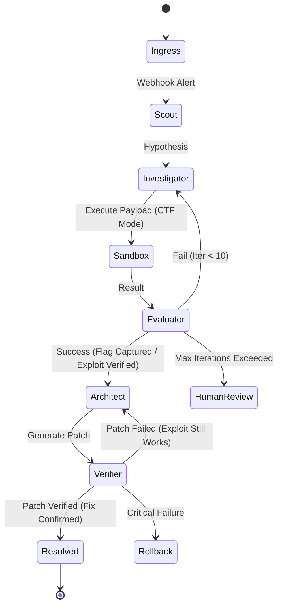

# Project Chimera: Autonomous Purple Team Pipeline

## 1. Overview
Project Chimera is an implementation of **Problem 03 (Autonomous Pipeline)**. It is a multi-agent system designed to act as an Autonomous Purple Team. When a security alert is triggered, the system autonomously scouts the target, acts as a Red Team to forensically reproduce the exploit, and acts as a Blue Team to generate and apply a verified code patch.

To survive the 24-hour hackathon constraint and ensure stability, the system uses a **Deterministic State Graph** (LangGraph) with strict tool sandboxing, structured JSON outputs, and persistent state management.

---

## 2. Core Architecture (State Machine)

The pipeline is modeled as a cyclic graph where nodes are LLM calls or Python execution blocks, managed by a LangGraph orchestrator.

### Mermaid Diagram


### The Graph State Object
```python
class GraphState(TypedDict):
    trace_id: str                # Unique identifier for the run
    alert_payload: dict          # The initial webhook data
    messages: list               # Truncated history (Last 5 turns)
    target_topography: str       # Summary of ports/services
    current_hypothesis: str      # Suspected vulnerability
    exploit_proof: str           # The successful payload string
    captured_flag: str           # Content of flag.txt (CTF proof)
    remediation_patch: str       # Generated git diff
    original_source: str         # Pre-patch file content for rollback
    status: str                  # "scouting", "investigating", "patching", "resolved", "failed"
    iteration_count: int         # Loop guard (Max 10)
    retry_count: int             # Transient failure tracker
```

### Node Definitions
1.  **Ingress (FastAPI + Redis-MQ):** Receives the webhook, pushes to a queue, and returns 202 Accepted.
2.  **Scout (Recon Agent):** Uses `ReadLogsTool` and `ScanNetworkTool`. Returns a 5-line summary via **Gemini 1.5 Flash**.
3.  **Investigator (Red Team):** Deep reasoning agent (**Llama 3 70B on Groq**). Generates payloads to replicate the breach and capture the flag.
4.  **Sandbox (Execution):** Pure Python. Executes payloads in isolated containers. Returns stdout/stderr/flag.
5.  **Evaluator:** Deterministic routing. If `flag.txt` content is found, transitions to Architect.
6.  **Architect (Blue Team):** **Gemini 1.5 Pro** (Large context). Analyzes the root cause and generates a git diff.
7.  **Verifier:** Re-runs the successful `exploit_proof` against the patched target.
8.  **Rollback:** Restores `original_source` if verification fails.

---

## 3. Technical Stack & Tooling ($0 Budget Strategy)

| Component | Technology | Why |
| :--- | :--- | :--- |
| **Orchestration** | LangGraph (Python) | State persistence and cycle management. |
| **High-Speed Engine** | **Llama 3 70B (Groq)** | **Sub-second inference for iterative forensic loops.** |
| **Deep Reasoning** | **Gemini 1.5 Pro (Google)** | **Free 1M+ context window for codebase analysis.** |
| **Fast Summarizer** | **Gemini 1.5 Flash (Google)** | **Fast and free for log/scan condensation.** |
| **Persistence** | SQLite / Redis | Durable `StateSaver` for crash recovery. |
| **Observability** | Omium SDK | Structured JSON logs and verifiable reasoning traces. |
| **Security** | Docker (Isolated) | Sandboxed execution with strict resource limits. |

---

## 4. CTF Mode (Proven Autonomy)
To demonstrate "Proven Autonomy," the pipeline incorporates a **Capture The Flag (CTF)** loop:
- **Target:** The Victim container contains a sensitive file at `/flag.txt`.
- **Goal:** The Investigator must retrieve the flag content as proof of root/unauthorized access.
- **Verification:** The "Resolved" status is only granted if the patch successfully blocks the exact payload that captured the flag.

---

## 5. Hardening & Security

- **Docker Sandboxing:** Sandbox container limited to `cpus: 0.5`, `mem_limit: 256m`, and no internet access.
- **Secrets:** API keys (Groq, Gemini) loaded via `.env`. Traces sanitized to redact sensitive strings.
- **Image Pinning:** Use explicit hash-pinned tags (e.g., `python:3.11-slim@sha256:...`) to ensure reproducible builds.
- **Iteration Guard:** Hard limit of 10 cycles to prevent infinite looping and cost overruns.

---

## 6. Running the Demo

1.  **Environment Setup:**
    ```bash
    cp .env.example .env
    # Add GROQ_API_KEY and GEMINI_API_KEY
    docker compose up -d
    ```
2.  **Trigger Pipeline:**
    ```bash
    curl -X POST http://localhost:8000/webhook \
      -H "Content-Type: application/json" \
      -d '{"type": "sqli", "target": "victim-service"}'
    ```
3.  **Monitor Dashboard:**
    Open `http://localhost:3000` to view the live LangGraph timeline and Omium reasoning trace.
