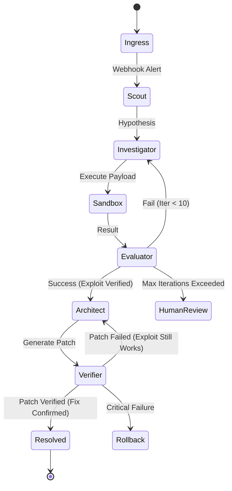

# Project Chimera: Autonomous Purple Team Pipeline

## 1. Overview
Project Chimera is an implementation of **Problem 03 (Autonomous Pipeline)**. It is a multi-agent system designed to act as an Autonomous Purple Team. When a security alert is triggered, the system autonomously scouts the target, acts as a Red Team to forensically reproduce the exploit, and acts as a Blue Team to generate and apply a verified code patch.

To survive the 24-hour hackathon constraint and ensure stability, the system uses a **Deterministic State Graph** (LangGraph) with strict tool sandboxing, structured JSON outputs, and persistent state management.

---

## 2. Core Architecture (State Machine)

The pipeline is modeled as a cyclic graph where nodes are LLM calls or Python execution blocks, managed by a LangGraph orchestrator.

### Mermaid Diagram


### The Graph State Object
```python
class GraphState(TypedDict):
    trace_id: str                # Unique identifier for the run
    alert_payload: dict          # The initial webhook data
    messages: list               # Truncated history (Last 5 turns)
    target_topography: str       # Summary of ports/services
    current_hypothesis: str      # Suspected vulnerability
    exploit_proof: str           # The successful payload string
    remediation_patch: str       # Generated git diff
    original_source: str         # Pre-patch file content for rollback
    status: str                  # "scouting", "investigating", "patching", "resolved", "failed"
    iteration_count: int         # Loop guard (Max 10)
    retry_count: int             # Transient failure tracker
```

### Node Definitions
1.  **Ingress (FastAPI + Redis-MQ):** Receives the webhook, pushes to a queue, and returns 202 Accepted.
2.  **Scout (Recon Agent):** Uses `ReadLogsTool` and `ScanNetworkTool`. Returns a 5-line summary via a cheap LLM (Claude 3.5 Haiku).
3.  **Investigator (Red Team):** Deep reasoning agent (Claude 3.5 Sonnet). Generates `AgentAction` Pydantic models.
4.  **Sandbox (Execution):** Pure Python. Uses `tenacity` for exponential back-off on Docker-SDK calls. Executes payloads in isolated containers.
5.  **Evaluator:** Deterministic routing. Increments `iteration_count`. If `> 10`, transitions to `HumanReview`.
6.  **Architect (Blue Team):** Analyzes the root cause and generates a git diff.
7.  **Verifier:** Re-runs the successful `exploit_proof` against the patched target. Success is only declared if the exploit is now blocked.
8.  **Rollback:** Restores `original_source` if the patch breaks the target or fails verification.

---

## 3. Technical Stack & Tooling

| Component | Technology | Why |
| :--- | :--- | :--- |
| **Orchestration** | LangGraph (Python) | State persistence and cycle management. |
| **Primary LLM** | Claude 3.5 Sonnet | Best-in-class reasoning and tool calling. |
| **Fallback LLM** | Llama 3 8B (Ollama) | Local redundancy if API limits hit or network fails. |
| **Persistence** | SQLite / Redis | Durable `StateSaver` to resume after crashes. |
| **Observability** | Structlog + Omium SDK | Structured JSON logs and verifiable reasoning traces. |
| **Metrics** | Prometheus Client | Real-time counters for success/failure rates. |
| **Security** | Docker (Isolated Network) | Sandboxed execution with no internet/host access. |

---

## 4. Hardening & Security

### A. Secrets Management
- All API keys are loaded via `.env` (excluded from git).
- `.env.example` provided for team synchronization.
- Sensitive strings are sanitized in UI traces and logs using regex-based redaction.

### B. Docker Sandboxing
- **Resource Limits:** Sandbox container limited to `cpus: 0.5` and `mem_limit: 256m`.
- **Isolation:** Sandbox has no internet access. Communication is strictly allowed only to the `Victim` container on a private bridge network.
- **Image Pinning:** Use `python:3.11-slim` (pinned by hash) to avoid "it works on my machine" version drift.

### C. Context Memory Control
The `Summarizer` sub-routine pipes raw tool outputs into a secondary model. The Orchestrator never receives more than 500 tokens of "context" per tool call, preventing context window drift and hallucinations.

---

## 5. Testing & Verification

### Patch Lifecycle
1.  **Generation:** Architect generates a diff based on the proven exploit.
2.  **Verification:** Verifier node applies the diff and runs the exact `exploit_proof`.
3.  **Validation:** If the exploit fails, `status` set to "resolved". If it succeeds, route back to Architect.
4.  **Commit:** Patch is committed to a local git repository via `GitPython` for a "real-world" DevOps trail.

### Automated Testing
- **Unit Tests:** Mock LLM and Docker SDK calls to test node transitions.
- **Integration Test:** `scripts/smoke_test.sh` fires a synthetic webhook and asserts the pipeline reaches "resolved" state in a CI/CD-like environment.

---

## 6. Running the Demo

1.  **Environment Setup:**
    ```bash
    cp .env.example .env
    # Add CLAUDE_API_KEY
    docker compose up -d
    ```
2.  **Trigger Pipeline:**
    ```bash
    curl -X POST http://localhost:8000/webhook \
      -H "Content-Type: application/json" \
      -d '{"type": "sqli", "target": "victim-service"}'
    ```
3.  **Monitor Dashboard:**
    Open `http://localhost:3000` to view the live LangGraph timeline and Omium reasoning trace.
